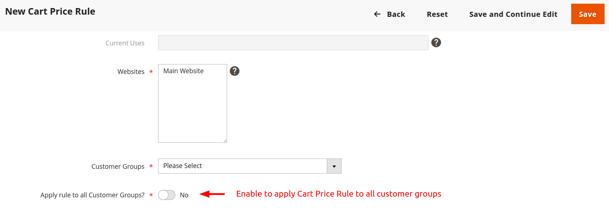

# SalesRuleExtendedGroups

Enhances the Cart Price Rules functionality by allowing Cart Price Rules to be applied to all customer groups, even if they have been created later.

## Functionality

- Adds a new option "All Groups" in the Customer Group field for Cart Price Rules.
- Simplifies the application of discounts to all customer groups without manually selecting each one.
- Applies the Cart Price Rule to customer groups, which have been created after corresponding Cart Price Rule. 

## Installation

To install the module, run the following commands from your Magento 2 root directory:

```bash
composer require pushonltd/module-sales-rule-extended-groups
bin/magento setup:upgrade
bin/magento setup:di:compile
bin/magento setup:static-content:deploy
```

## Usage

After installation, navigate to **Marketing > Cart Price Rules** in the Magento Admin Panel. When creating or editing a rule, you'll find the switcher "Apply rule to all Customer Groups?" under the Customer Groups field.  
Enabling it applies the rule to all customer groups.


